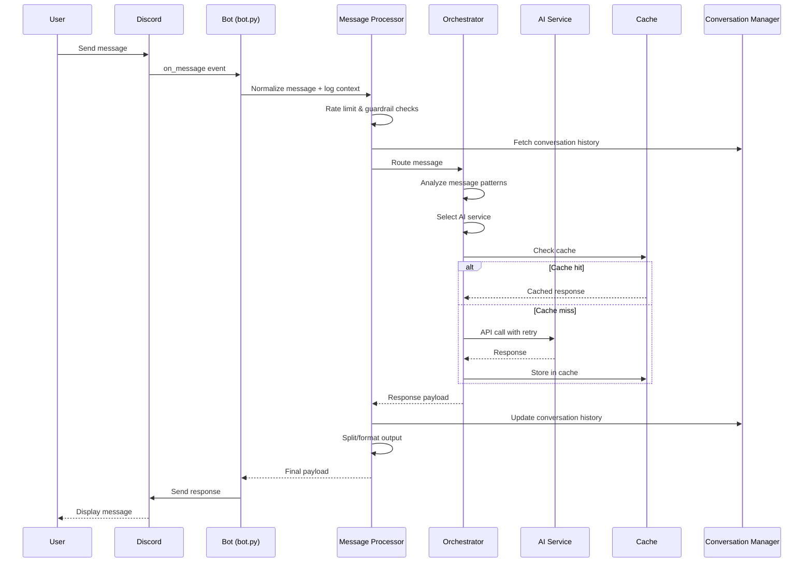

# DiscordianAI Architecture

This document provides a comprehensive overview of the DiscordianAI system architecture, design patterns, and component interactions.

## 📐 High-Level Architecture

```
┌─────────────────────────────────────────────────────────────────────────┐
│                              Discord                                     │
│                          (Discord Gateway)                               │
└─────────────────────────────────────────┬───────────────────────────────┘
                                          │
                                          ▼
┌─────────────────────────────────────────────────────────────────────────┐
│                           Discord Bot Layer                              │
│  ┌──────────────┐  ┌──────────────┐  ┌──────────────┐  ┌──────────────┐ │
│  │   bot.py     │  │ discord_bot  │  │ discord_     │  │ message_     │ │
│  │ (Event Loop) │  │   .py        │  │ embeds.py    │  │ processor.py │ │
│  └──────┬───────┘  └──────────────┘  └──────────────┘  └──────┬───────┘ │
│                                                       ┌───────▼───────┐ │
│                                                       │ message_      │ │
│                                                       │ splitter.py   │ │
│                                                       └───────────────┘ │
└─────────┼───────────────────────────────────────────────────────────────┘
          │
          ▼
┌─────────────────────────────────────────────────────────────────────────┐
│                         Orchestration Layer                              │
│  ┌────────────────────────────────────────────────────────────────────┐ │
│  │                     smart_orchestrator.py                          │ │
│  │   • Query Classification (time-sensitive, factual, conversational) │ │
│  │   • AI Service Selection (OpenAI vs Perplexity)                    │ │
│  │   • Follow-up Detection & Consistency                              │ │
│  └────────────────────────────────────────────────────────────────────┘ │
└─────────┬───────────────────────────────────────────────────────────────┘
          │
          ▼
┌─────────────────────────────────────────────────────────────────────────┐
│                           AI Service Layer                               │
│  ┌─────────────────────┐              ┌─────────────────────┐          │
│  │ openai_processing.py│              │perplexity_processing│          │
│  │  • GPT-5 Models     │              │  • Sonar Models     │          │
│  │  • Conversational   │              │  • Web Search       │          │
│  │  • Creative Tasks   │              │  • Citations        │          │
│  └──────────┬──────────┘              └──────────┬──────────┘          │
└─────────────┼──────────────────────────────────────┼────────────────────┘
              │                                      │
              ▼                                      ▼
┌─────────────────────────────────────────────────────────────────────────┐
│                        Infrastructure Layer                              │
│  ┌─────────────┐ ┌─────────────┐ ┌─────────────┐ ┌──────────────────┐  │
│  │connection_  │ │ caching.py  │ │error_       │ │ conversation_    │  │
│  │pool.py      │ │ (LRU+TTL)   │ │handling.py  │ │ manager.py       │  │
│  │ (HTTP/2)    │ │             │ │(Circuit     │ │ (Thread-safe)    │  │
│  │             │ │             │ │ Breaker)    │ │                  │  │
│  └─────────────┘ └─────────────┘ └─────────────┘ └──────────────────┘  │
└─────────────────────────────────────────────────────────────────────────┘
```

## 🧩 Component Overview

### Entry Points

| Component | File | Purpose |
|-----------|------|---------|
| **Main** | `main.py` | Application entry point, startup sequence, logging setup |
| **Bot** | `bot.py` | Discord client initialization, event handlers, graceful shutdown |

### Core Processing

| Component | File | Purpose |
|-----------|------|---------|
| **Smart Orchestrator** | `smart_orchestrator.py` | AI service selection logic based on message analysis |
| **OpenAI Processing** | `openai_processing.py` | GPT-5 API interactions, conversation handling |
| **Perplexity Processing** | `perplexity_processing.py` | Web search, citation extraction |
| **Web Scraper** | `web_scraper.py` | URL content extraction for context enrichment |

### Infrastructure

| Component | File | Purpose |
|-----------|------|---------|
| **Config** | `config.py` | Configuration loading, constants, patterns |
| **Connection Pool** | `connection_pool.py` | HTTP/2 connection pooling for API clients |
| **Caching** | `caching.py` | Response caching, request deduplication |
| **Error Handling** | `error_handling.py` | Circuit breaker, retry logic, error classification |
| **Conversation Manager** | `conversation_manager.py` | Thread-safe conversation history |
| **Rate Limiter** | `rate_limits.py` | Per-user rate limiting |
| **Health Checks** | `health_checks.py` | API health monitoring, metrics |

### Discord Integration

| Component | File | Purpose |
|-----------|------|---------|
| **Discord Bot** | `discord_bot.py` | Activity status, presence management |
| **Discord Embeds** | `discord_embeds.py` | Citation formatting, embed creation |
| **Message Processor** | `message_processor.py` | Normalizes Discord events, delegates to orchestrator, records metadata |
| **Message Splitter** | `message_splitter.py` | Message splitting, formatting, sanitization |
| **API Validation** | `api_validation.py` | Configuration validation, API key format checks |

## ⚙️ Operational Features

- **Rate Limiting** (`rate_limits.py`): Per-user buckets enforce `[Limits]` from config.ini so spam never overwhelms upstream APIs.
- **Conversation History** (`conversation_manager.py`): Thread-safe per-user transcripts preserve context while pruning automatically.
- **Activity & Presence** (`discord_bot.py` + config): Status text, presence state, and activity type are configurable at runtime.
- **Direct Messages** (`bot.py`): DM sessions bypass mention requirements but still honor rate limits and consistency checks.
- **Channel Targeting** (`message_router.py`): `ALLOWED_CHANNELS` gating ensures the bot only replies where it is expected.
- **Smart Message Splitting** (`message_splitter.py`): Discord-safe splitting protects code blocks, embeds, and citations from truncation.
- **Global Exception Handling** (`error_handling.py` + `bot.py`): Centralized logging and graceful fallbacks keep the process alive after faults.
- **Shard Support** (`discord_bot.py`): When large guild counts demand it, the client can run in sharded mode for scalability.

## 🔄 Request Flow



## 🎯 Design Patterns

### 1. Dependency Injection (Informal)

The bot uses a `deps` dictionary to pass dependencies between components:

```python
deps = {
    "logger": logger,
    "bot": bot,
    "client": openai_client,
    "perplexity_client": perplexity_client,
    "rate_limiter": rate_limiter,
    "conversation_manager": conversation_manager,
    "config": config,
}
```

**Benefits:**
- Testable components (easy to mock)
- Loose coupling between modules
- Configuration flexibility

### 2. Circuit Breaker Pattern

Implemented in `error_handling.py` to prevent cascade failures:

```python
class CircuitBreaker:
    """States: CLOSED → OPEN → HALF_OPEN → CLOSED"""
    
    def __init__(self, failure_threshold=5, timeout=60):
        self.failure_threshold = failure_threshold
        self.timeout = timeout
        self.state = "CLOSED"
```

**State Transitions:**
- **CLOSED**: Normal operation, requests pass through
- **OPEN**: After N failures, reject requests immediately
- **HALF_OPEN**: After timeout, allow one test request

### 3. Decorator-Based Caching

```python
@cached_response(ttl=300)
@deduplicated_request()
async def process_openai_message(...):
    ...
```

**Features:**
- TTL-based expiration
- Request deduplication (prevents duplicate API calls)
- Thread-safe LRU cache

### 4. Thread-Safe Conversation Management

```python
class ThreadSafeConversationManager:
    def __init__(self):
        self._conversations: dict[int, list[dict]] = {}
        self._user_locks: dict[int, threading.RLock] = {}
        self._global_lock = threading.RLock()
```

**Features:**
- Per-user locking for fine-grained concurrency
- Automatic history pruning
- Deep copy returns to prevent external modification

### 5. Retry with Exponential Backoff

```python
@dataclass
class RetryConfig:
    max_attempts: int = 3
    base_delay: float = 1.0
    max_delay: float = 60.0
    exponential_base: float = 2.0
    jitter: bool = True  # Prevents thundering herd
```

## 🔐 Security Architecture

### API Key Handling
- Keys loaded from config files or environment variables
- Format validation before use (sk-*, pplx-*)
- Never logged or exposed in error messages

### Input Validation
- Message content sanitization
- URL validation patterns
- Rate limiting per user

### Pre-commit Hooks
- `detect-secrets` prevents accidental key commits
- `.secrets.baseline` for tracking known safe strings

## 📊 Observability

### Logging
- Structured logging with configurable levels
- Separate file and console handlers
- Request/response metadata logging

### Health Checks
- API connectivity monitoring
- Model availability validation
- Connection pool health metrics

### Metrics (via `APIHealthMetrics`)
- Total/successful/failed checks
- Average response times
- Consecutive failure tracking
- Uptime percentage

## 🚀 Performance Optimizations

### Connection Pooling
```python
# HTTP/2 with connection reuse
limits = httpx.Limits(
    max_connections=50,
    max_keepalive_connections=10,
)
```

### Caching Strategy
- Response cache: 5-minute TTL
- Conversation cache: 30-minute TTL
- LRU eviction with 1000 entry limit

### Async Everything
- All API calls are async
- Discord.py async event loop
- Non-blocking conversation updates

## 🧪 Testing Architecture

```
tests/
├── test_bot.py                    # Bot initialization tests
├── test_config.py                 # Configuration loading tests
├── test_api_validation.py         # API validation tests
├── test_error_handling.py         # Circuit breaker, retry tests
├── test_conversation_manager.py   # Thread safety tests
├── test_load_stress.py            # High concurrency tests
├── test_message_splitting.py      # Discord message handling
└── ...
```

**Coverage Target:** 80%+ (enforced by CI)

## 📁 Project Structure

```
DiscordianAI/
├── src/
│   ├── __init__.py           # Package exports
│   ├── py.typed              # PEP 561 type hints marker
│   ├── main.py               # Entry point
│   ├── bot.py                # Discord bot core
│   ├── config.py             # Configuration (single source of truth)
│   ├── smart_orchestrator.py # AI routing logic
│   ├── openai_processing.py  # OpenAI integration
│   ├── perplexity_processing.py # Perplexity integration
│   ├── connection_pool.py    # HTTP connection management
│   ├── conversation_manager.py # Thread-safe conversations
│   ├── error_handling.py     # Resilience patterns
│   ├── caching.py            # Response caching
│   ├── rate_limits.py        # Rate limiting
│   ├── health_checks.py      # API monitoring
│   └── ...
├── tests/                    # Test suite
├── docs/                     # Documentation
├── pyproject.toml            # Build & tool configuration
├── tox.ini                   # Test automation
└── docker-compose.yml        # Container orchestration
```

## 🔮 Future Considerations

### Potential Improvements
1. **Formal DI Container**: Replace `deps` dict with dataclass
2. **Protocol Classes**: Define interfaces for AI clients
3. **Structured Logging**: JSON format for log aggregation
4. **Metrics Export**: Prometheus/OpenTelemetry integration
5. **HTTP Health Endpoint**: For container orchestration
6. **Message Queue**: For high-volume deployments

### Scalability Path
- Current: Single instance, in-memory state
- Future: Redis for distributed caching/rate limiting
- Future: Multiple bot instances with shared state

