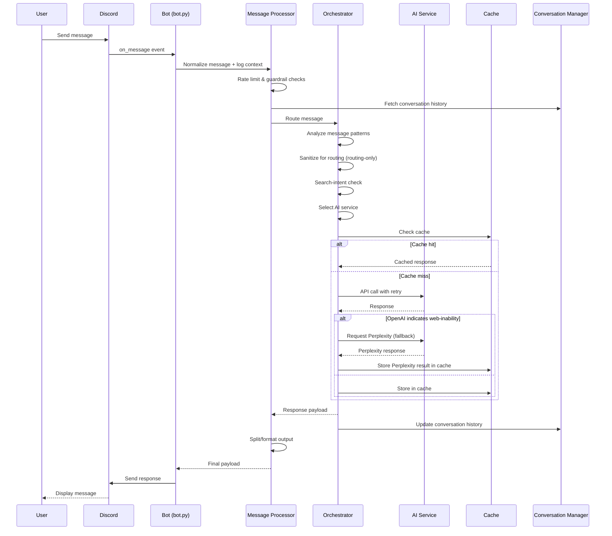

# DiscordianAI Architecture

This document provides a comprehensive overview of the DiscordianAI system architecture, design patterns, and component interactions.

## 📐 High-Level Architecture

```
┌────────────────────────────────────────────────────────────────────────────────────────┐
│ Discord Gateway                                                                         │
└────────────────────────────────────────────────┬───────────────────────────────────────┘
                                                 │
                                                 ▼
┌────────────────────────────────────────────────────────────────────────────────────────┐
│ Entry & Routing                                                                         │
│ ┌──────────────────────────┬──────────────────────────┬──────────────────────────┐     │
│ │ main.py                  │ bot.py                   │ bot_manager.py           │     │
│ │ message_router.py        │ message_processor.py     │ discord_bot.py           │     │
│ │ dependencies.py          │ logging_adapter.py       │ __init__.py              │     │
│ │ models.py                │                          │                          │     │
│ └──────────────────────────┴──────────────────────────┴──────────────────────────┘     │
└────────────────────────────────────────────────┬───────────────────────────────────────┘
                                                 │
                                                 ▼
┌────────────────────────────────────────────────────────────────────────────────────────┐
│ Discord Presentation                                                                    │
│ ┌──────────────────────────┬──────────────────────────┬──────────────────────────┐     │
│ │ discord_embeds.py        │ message_splitter.py      │ web_scraper.py           │     │
│ │ api_validation.py        │                          │                          │     │
│ │                          │                          │                          │     │
│ │                          │                          │                          │     │
│ └──────────────────────────┴──────────────────────────┴──────────────────────────┘     │
└────────────────────────────────────────────────┬───────────────────────────────────────┘
                                                 │
                                                 ▼
┌────────────────────────────────────────────────────────────────────────────────────────┐
│ Orchestration & AI Selection                                                            │
│ ┌──────────────────────────┬──────────────────────────┬──────────────────────────┐     │
│ │ smart_orchestrator.py    │ openai_processing.py     │ perplexity_processing.py │     │
│ │                          │                          │                          │     │
│ │                          │                          │                          │     │
│ │                          │                          │                          │     │
│ └──────────────────────────┴──────────────────────────┴──────────────────────────┘     │
└────────────────────────────────────────────────┬───────────────────────────────────────┘
                                                 │
                                                 ▼
┌────────────────────────────────────────────────────────────────────────────────────────┐
│ Infrastructure & Resilience                                                             │
│ ┌──────────────────────────┬──────────────────────────┬──────────────────────────┐     │
│ │ connection_pool.py       │ caching.py               │ error_handling.py        │     │
│ │ conversation_manager.py  │ rate_limits.py           │ health_checks.py         │     │
│ │ health_server.py         │ api_context.py           │ structured_logging.py    │     │
│ │ dependency_check.py      │                          │                          │     │
│ └──────────────────────────┴──────────────────────────┴──────────────────────────┘     │
└────────────────────────────────────────────────┬───────────────────────────────────────┘
                                                 │
                                                 ▼
┌────────────────────────────────────────────────────────────────────────────────────────┐
│ Shared Support & Packaging                                                              │
│ ┌──────────────────────────┬──────────────────────────┬──────────────────────────┐     │
│ │ config.py                │ py.typed                 │                          │     │
│ │                          │                          │                          │     │
│ │                          │                          │                          │     │
│ │                          │                          │                          │     │
│ └──────────────────────────┴──────────────────────────┴──────────────────────────┘     │
└────────────────────────────────────────────────────────────────────────────────────────┘
```

## 🧩 Component Overview

### Entry Points

| Component | File | Purpose |
|-----------|------|---------|
| **Main** | `main.py` | Application entry point, startup sequence, logging setup |
| **Bot** | `bot.py` | Discord client initialization, event handlers, graceful shutdown |

### Core Processing

| Component | File | Purpose |
|-----------|------|---------|
| **Smart Orchestrator** | `smart_orchestrator.py` | AI service selection logic based on message analysis |
| **OpenAI Processing** | `openai_processing.py` | GPT-5 API interactions, response formatting |
| **Perplexity Processing** | `perplexity_processing.py` | Web search, citation extraction |
| **Web Scraper** | `web_scraper.py` | URL content extraction for context enrichment |

### Infrastructure

| Component | File | Purpose |
|-----------|------|---------|
| **Config** | `config.py` | Configuration loading, constants, patterns |
| **Connection Pool** | `connection_pool.py` | HTTP/2 connection pooling for API clients |
| **Caching** | `caching.py` | Response caching, request deduplication |
| **Error Handling** | `error_handling.py` | Circuit breaker, retry logic, error classification |
| **Conversation Manager** | `conversation_manager.py` | Thread-safe conversation history |
| **Rate Limiter** | `rate_limits.py` | Per-user rate limiting |
| **Health Checks** | `health_checks.py` | API health monitoring, metrics |
| **Health Server** | `health_server.py` | HTTP liveness/readiness probes (Kubernetes-compatible) |
| **API Context** | `api_context.py` | Context managers for API call lifecycle, timing, and error tracking |
| **Structured Logging** | `structured_logging.py` | structlog configuration and structured logger factory |
| **Dependencies** | `dependencies.py` | `BotDependencies` dataclass for formal dependency injection |

### Discord Integration

| Component | File | Purpose |
|-----------|------|---------|
| **Discord Bot** | `discord_bot.py` | Activity status, presence management |
| **Discord Embeds** | `discord_embeds.py` | Citation formatting, embed creation |
| **Message Processor** | `message_processor.py` | Normalizes Discord events, delegates to orchestrator, records metadata |
| **Message Splitter** | `message_splitter.py` | Message splitting, formatting, sanitization |
| **API Validation** | `api_validation.py` | Configuration validation, API key format checks |

## ⚙️ Operational Features

- **Rate Limiting** (`rate_limits.py`): Per-user buckets enforce `[Limits]` from config.ini so spam never overwhelms upstream APIs.
- **Conversation History** (`conversation_manager.py`): Thread-safe per-user transcripts preserve context while pruning automatically.
- **Activity & Presence** (`discord_bot.py` + config): Status text, presence state, and activity type are configurable at runtime.
- **Direct Messages** (`bot.py`): DM sessions bypass mention requirements but still honor rate limits and consistency checks.
- **Channel Targeting** (`message_router.py`): `ALLOWED_CHANNELS` gating ensures the bot only replies where it is expected.
- **Smart Message Splitting** (`message_splitter.py`): Discord-safe splitting protects code blocks, embeds, and citations from truncation.
- **Global Exception Handling** (`error_handling.py` + `bot.py`): Centralized logging and graceful fallbacks keep the process alive after faults.
- **Health Server** (`health_server.py`): Lightweight HTTP endpoint for liveness/readiness probes, compatible with Kubernetes and load balancers.

## 🔄 Request Flow


```mermaid
sequenceDiagram
    participant U as User
    participant D as Discord
    participant B as Bot (bot.py)
    participant MP as Message Processor
    participant O as Orchestrator
    participant AI as AI Service
    participant C as Cache
    participant CM as Conversation Manager

    U->>D: Send message
    D->>B: on_message event
    B->>MP: Normalize message + log context
    MP->>MP: Rate limit & guardrail checks
    MP->>CM: Fetch conversation history
    MP->>O: Route message
    O->>O: Analyze message patterns
    O->>O: Sanitize for routing (routing-only)
    O->>O: Search-intent check
    O->>O: Select AI service
    O->>C: Check cache
    alt Cache hit
        C-->>O: Cached response
    else Cache miss
        O->>AI: API call with retry
        AI-->>O: Response
        %% If OpenAI responded but indicates web-inability, orchestrator reroutes
        alt OpenAI indicates web-inability
            O->>AI: Request Perplexity (fallback)
            AI-->>O: Perplexity response
            O->>C: Store Perplexity result in cache
        else
            O->>C: Store in cache
        end
    end
    O-->>MP: Response payload
    O->>CM: Update conversation history
    MP->>MP: Split/format output
    MP-->>B: Final payload
    B->>D: Send response
    D-->>U: Display message
```

## 🎯 Design Patterns

### 1. Dependency Injection

The bot uses a typed `BotDependencies` dataclass to pass dependencies between components:

```python
from src.dependencies import BotDependencies

deps = BotDependencies(
    bot=discord_client,
    logger=logger,
    config=config,
    client=openai_client,
    perplexity_client=perplexity_client,
    rate_limiter=rate_limiter,
    conversation_manager=conversation_manager,
)
```

The dataclass supports dict-style access (`deps["logger"]`, `deps.get("key")`, `"key" in deps`) and `.to_dict()` for backward compatibility with legacy code.

**Benefits:**
- Typed dependencies with IDE autocompletion
- Testable components (easy to mock)
- Loose coupling between modules
- Configuration flexibility with backward-compatible dict access

### 2. Circuit Breaker Pattern

Implemented in `error_handling.py` to prevent cascade failures:

```python
class CircuitBreaker:
    """States: CLOSED → OPEN → HALF_OPEN → CLOSED"""
    
    def __init__(self, failure_threshold=5, timeout=60):
        self.failure_threshold = failure_threshold
        self.timeout = timeout
        self.state = "CLOSED"
```

**State Transitions:**
- **CLOSED**: Normal operation, requests pass through
- **OPEN**: After N failures, reject requests immediately
- **HALF_OPEN**: After timeout, allow one test request

### 3. Decorator-Based Caching

```python
@cached_response(ttl=300)
@deduplicated_request()
async def process_openai_message(...):
    ...
```

`_extract_message_context()` has been extracted as a shared helper, but the full decorator stack shown here is still aspirational; the codebase currently uses explicit caching and deduplication helpers.

**Features:**
- TTL-based expiration
- Request deduplication (prevents duplicate API calls)
- Thread-safe LRU cache

### 4. Thread-Safe Conversation Management

```python
class ThreadSafeConversationManager:
    def __init__(self):
        self._conversations: dict[int, list[dict]] = {}
        self._user_locks: dict[int, threading.RLock] = {}
        self._global_lock = threading.RLock()
```

**Features:**
- Per-user locking for fine-grained concurrency
- Automatic history pruning
- Deep copy returns to prevent external modification

### 5. Retry with Flat Jittered Delay

```python
@dataclass
class RetryConfig:
    max_attempts: int = 2
    base_delay: float = 2.0
    max_delay: float = 4.0
    exponential_base: float = 1.0
    jitter: bool = True  # Prevents thundering herd
```

## 🔐 Security Architecture

### API Key Handling
- Keys loaded from config files or environment variables
- Format validation before use (sk-*, pplx-*)
- Never logged or exposed in error messages

### Input Validation
- Message content sanitization
- URL validation patterns
- Rate limiting per user

### Pre-commit Hooks
- `detect-secrets` prevents accidental key commits

## 📊 Observability

### Logging
- Structured logging with configurable levels
- Separate file and console handlers
- Request/response metadata logging

### Health Checks
- API connectivity monitoring
- Model availability validation
- Connection pool health metrics

### Metrics (via `APIHealthMetrics`)
- Total/successful/failed checks
- Average response times
- Consecutive failure tracking
- Uptime percentage

## 🚀 Performance Optimizations

### Connection Pooling
```python
from src.connection_pool import ConnectionPoolManager

pool = ConnectionPoolManager()
client = pool.get_openai_client()
```

### Caching Strategy
- Response cache: 5-minute TTL
- Conversation cache: 30-minute TTL
- LRU eviction with 1000 entry limit

### Async Everything
- All API calls are async
- Discord.py async event loop
- Non-blocking conversation updates

## 🧪 Testing Architecture

```
tests/
├── test_bot.py                    # Bot initialization tests
├── test_config.py                 # Configuration loading tests
├── test_api_validation.py         # API validation tests
├── test_error_handling.py         # Circuit breaker, retry tests
├── test_conversation_manager.py   # Thread safety tests
├── test_load_stress.py            # High concurrency tests
├── test_message_splitting.py      # Discord message handling
└── ...
```

**Coverage Target:** 84%+ (enforced by CI)

## 📁 Project Structure

```
DiscordianAI/
├── src/
│   ├── __init__.py              # Package exports
│   ├── health_checks.py         # API monitoring
│   ├── api_validation.py        # Configuration validation
│   ├── api_utils.py             # Shared API helpers
│   ├── message_processor.py     # Discord event normalization
│   ├── rate_limits.py           # Rate limiting
│   ├── bot.py                   # Discord bot core
│   ├── web_scraper.py           # URL content extraction
│   ├── smart_orchestrator.py    # AI routing logic
│   ├── openai_processing.py     # OpenAI integration
│   ├── structured_logging.py    # structlog configuration
│   ├── caching.py               # Response caching
│   ├── health_server.py         # HTTP liveness/readiness probes
│   ├── dependency_check.py      # Dependency validation
│   ├── api_context.py           # API call context managers
│   ├── message_router.py        # Mention and DM routing
│   ├── conversation_manager.py  # Thread-safe conversations
│   ├── error_handling.py        # Resilience patterns
│   ├── logging_adapter.py       # Structured logging adapter
│   ├── perplexity_processing.py # Perplexity integration
│   ├── main.py                  # Entry point
│   ├── connection_pool.py       # HTTP connection management
│   ├── discord_embeds.py        # Citation embed formatting
│   ├── discord_bot.py           # Activity / presence management
│   ├── models.py                # Shared data models
│   ├── dependencies.py          # BotDependencies dataclass (DI)
│   ├── config.py                # Configuration (single source of truth)
│   ├── message_splitter.py      # Message splitting and formatting
│   ├── py.typed                 # PEP 561 type hints marker
│   └── bot_manager.py           # Lifecycle management
├── tests/                    # Test suite
├── docs/                     # Documentation
├── pyproject.toml            # Build & tool configuration
├── tox.ini                   # Test automation
└── docker-compose.yml        # Container orchestration
```

## 🔮 Future Considerations

### Potential Improvements
1. **Protocol Classes**: Define interfaces for AI clients (pre-empt multi-platform support)
2. **Metrics Export**: Prometheus/OpenTelemetry integration
3. **Message Queue**: For high-volume deployments

### Scalability Path
- Current: Single instance, in-memory state
- Future: Redis for distributed caching/rate limiting
- Future: Multiple bot instances with shared state
