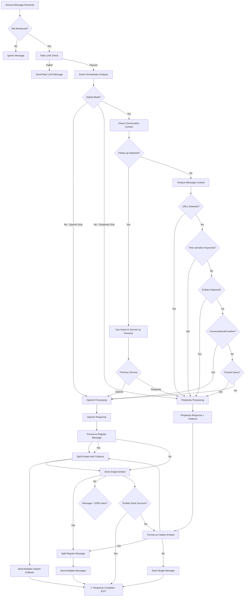

# Smart AI Mode: Advanced GPT-5 + Perplexity Integration

## Overview

DiscordianAI features a sophisticated AI orchestration system with intelligent routing, conversation consistency, and three flexible operation modes:

1. **OpenAI Only** - Use GPT-5 for all responses
2. **Perplexity Only** - Use Sonar-Pro with web search for all responses  
3. **Smart Hybrid** - Automatically choose the best AI for each message with conversation consistency

## AI Service Consistency System 🔄

DiscordianAI features an advanced **conversation consistency system** that ensures follow-up questions are routed to the same AI service that handled the initial query, maintaining context and coherence.

### How It Works

1. **Metadata Tracking**: Every AI response includes metadata about which service generated it
2. **Follow-up Detection**: Automatically detects when users ask follow-up questions using advanced pattern matching
3. **Consistent Routing**: Routes follow-ups to the same AI service for conversational continuity

### Example Flow
```
User: "What's the weather in Tokyo today?"
→ 🌐 Routed to Perplexity (time-sensitive, current data needed)
→ Response: "Tokyo is currently 22°C with light rain..." + metadata

User: "Tell me more about the forecast"  
→ 🔄 Detected as follow-up, checks recent AI service used
→ 🌐 Routed to Perplexity for consistency
→ User gets detailed forecast from same service with full context
```

### Follow-up Detection Patterns
The system recognizes these follow-up indicators:
- **Continuation**: "continue", "more", "tell me more", "also", "furthermore"
- **References**: "what about", "how about", "regarding that"
- **Connectors**: "and", "but", "however" + question mark
- **Responses**: "yes, but...", "okay, and...", "no, what about..."

## Message Flow Architecture

The following diagram shows how messages flow through the DiscordianAI system:



### Key Anti-Duplication Features

The diagram above shows the **critical control flow fix** that prevents duplicate messages:

1. **Single Entry Point**: All responses go through `send_formatted_message` 
2. **Explicit Returns**: Each successful send has a `return` statement to exit the function
3. **Embed Priority**: Perplexity responses with citations try embed first, fallback to regular message only on failure
4. **No Fallthrough**: Fixed the bug where embed success still continued to regular message logic

This ensures **exactly one message** is sent per user query, eliminating the duplicate message issue.

## Smart Detection (No Manual Triggers Required!)

The bot uses advanced semantic analysis to automatically determine when web search would be beneficial:

### Smart Detection Criteria

**Uses Web Search When:**
- Time-sensitive questions ("today", "recently", "latest")
- Factual queries about changeable information (weather, stocks, news)
- Questions about specific companies, people, or current events
- Longer, detailed questions that suggest need for current data

**Uses Regular AI When:**
- Creative requests (stories, poems, jokes)
- Technical/coding help
- Philosophical discussions
- Personal conversations and greetings
- General knowledge that doesn't change

### Example Auto-Detection

**Automatically Uses Perplexity:**
- "What's happening in AI today?" ← Time-sensitive
- "How's Tesla's stock doing?" ← Financial data
- "What's the weather like?" ← Current information
- "Tell me about the recent SpaceX launch" ← Current events

**Automatically Uses GPT-5:**
- "Write me a poem about robots" ← Creative
- "How do I fix this Python error?" ← Technical
- "What do you think about philosophy?" ← Opinion/conversation
- "Hello! How are you?" ← Greeting

## Discord Citation Features

### Proper Hyperlinks
- Converts numbered citations [1], [2] into clickable Discord hyperlinks
- Format: `[1](https://full-url)` - preserves the citation number for readability
- No more unclickable numbers in brackets!

### Smart Embed Suppression
- Automatically suppresses link previews when there are multiple citations
- Prevents chat from being cluttered with preview images
- Keeps messages readable and focused

## Configuration Modes

### Mode 1: Smart Hybrid (Recommended)
Uses both APIs and automatically chooses the best one:

```ini
# Both APIs configured
OPENAI_OPENAI_API_KEY=your_openai_api_key_here
PERPLEXITY_API_KEY=your_perplexity_api_key_here
```

### Mode 2: OpenAI Only
Uses only GPT-5 for all responses:

```ini
# Only OpenAI configured
OPENAI_OPENAI_API_KEY=your_openai_api_key_here
PERPLEXITY_API_KEY=
```

### Mode 3: Perplexity Only
Uses only Perplexity with web search for all responses:

```ini
# Only Perplexity configured  
OPENAI_API_KEY=
PERPLEXITY_API_KEY=your_perplexity_api_key_here
```

## Advanced Configuration: AI Orchestrator Settings ⚙️

Fine-tune the AI service selection behavior with these advanced configuration options in your `config.ini`:

```ini
[Orchestrator]
# AI Orchestrator Configuration for advanced routing and optimization
# How many recent messages to check for AI service consistency
LOOKBACK_MESSAGES_FOR_CONSISTENCY=6

# Maximum conversation entries per user before pruning
MAX_HISTORY_PER_USER=50

# Maximum conversation entries per user before pruning
MAX_HISTORY_PER_USER=50

# How often to clean up inactive user locks (seconds) - default 1 hour
USER_LOCK_CLEANUP_INTERVAL=3600
```

### Configuration Explained

| Setting | Default | Description |
|---------|---------|-------------|
| `LOOKBACK_MESSAGES_FOR_CONSISTENCY` | 6 | How many recent messages to check when determining AI service consistency for follow-ups |
| `MAX_HISTORY_PER_USER` | 50 | Maximum conversation entries stored per user (older entries are automatically pruned) |
| `USER_LOCK_CLEANUP_INTERVAL` | 3600 | How often to clean up memory from inactive users (in seconds) |

### Performance Impact
- **Higher `LOOKBACK_MESSAGES_FOR_CONSISTENCY`**: More accurate consistency but slightly more processing
- **Higher `MAX_HISTORY_PER_USER`**: Better long-term context but more memory usage
- **Lower `USER_LOCK_CLEANUP_INTERVAL`**: More frequent memory cleanup but slight CPU overhead

## Setup Instructions

### 1. Get API Keys (as needed)

**OpenAI API Key** (for GPT-5):
- Go to https://platform.openai.com/api-keys
- Create a new API key

**Perplexity API Key** (for web search):
- Go to https://www.perplexity.ai/settings/api
- Generate an API key

### 2. Choose Your Configuration

Pick the example config that matches your preferred mode:
- `config.ini.hybrid.example` - Smart hybrid mode (both APIs)
- `config.openai-only.example` - GPT-5 only mode
- `config.perplexity-only.example` - Perplexity only mode

Copy your chosen example to `config.ini` and fill in your API keys.

### 3. Test It

Start your bot and try these examples:

- "Hello!" ← Uses GPT-5
- "What's the latest AI news?" ← Uses Perplexity
- "Tell me about today's weather" ← Uses Perplexity
- "How do I learn Python?" ← Uses GPT-5

## Fallback Behavior

If Perplexity is unavailable or not configured:
- The bot falls back to GPT-5 for all responses
- You'll see a warning in the logs about web search being disabled

## Cost Considerations

- **GPT-5**: Higher cost per token but excellent reasoning
- **Perplexity**: Lower cost for web search, includes citations
- The bot automatically chooses the most cost-effective option based on the query type

## Monitoring & Debugging 🔍

Check your logs to see the AI orchestration system in action:

### AI Service Selection Logs
```
INFO: Smart orchestrator processing message from user 123456789: What's the weather...
INFO: Running in hybrid mode - analyzing message for optimal routing
INFO: Message analysis suggests web search would be beneficial - trying Perplexity first
INFO: Perplexity response generated successfully (245 chars)
```

### Consistency System Logs  
```
INFO: Smart orchestrator processing message from user 123456789: Tell me more...
INFO: Running in hybrid mode - analyzing message for optimal routing
DEBUG: Follow-up detected, using recent AI service: perplexity
INFO: Message analysis suggests web search would be beneficial - trying Perplexity first
INFO: Perplexity response successful in hybrid mode (312 chars)
```

### Conversation Management
```
DEBUG: Retrieved conversation for user 123456789: 8 messages
DEBUG: Generated conversation summary for user 123456789: 6 messages
INFO: Added assistant message for user 123456789: 245 chars, total history: 9 messages
```

### Performance Monitoring
```
INFO: Cleaned up 3 inactive user locks for memory optimization
DEBUG: Rate limit check successful for User123 (ID: 123456789)
```

## Thread-Safe Architecture 🔒

DiscordianAI uses a robust thread-safe architecture that handles concurrent users safely:

### Features
- **Per-User Locking**: Each user has their own conversation lock to prevent race conditions
- **Thread-Safe Conversation Management**: All conversation operations are atomic and thread-safe  
- **Memory Management**: Automatic cleanup of inactive user locks to prevent memory leaks
- **Metadata Tracking**: AI service information stored with each message for consistency

### Benefits
- **Concurrent Users**: Multiple users can chat simultaneously without data corruption
- **Consistent State**: Conversation state remains consistent even under high load
- **Memory Efficiency**: Automatic cleanup prevents memory bloat in long-running deployments
- **Production Ready**: Designed for high-availability production environments

## Customization & Advanced Usage 🛠️

### Detection Pattern Customization
Adjust the AI service selection patterns in `src/smart_orchestrator.py`:

```python
# Time-sensitive patterns
_TIME_SENSITIVITY_PATTERNS = [
    re.compile(r"\b(today|yesterday|this week|recently|latest|current|now)\b", re.IGNORECASE),
    # Add your custom time-sensitive keywords here
]

# Follow-up detection patterns  
_FOLLOW_UP_PATTERNS = [
    re.compile(r"\b(continue|more|tell me more|also|furthermore)\b", re.IGNORECASE),
    # Add your custom follow-up patterns here
]
```

### Environment Variable Override
All configuration values can be overridden via environment variables:

```bash
export LOOKBACK_MESSAGES_FOR_CONSISTENCY=8
export ENTITY_DETECTION_MIN_WORDS=5
export MAX_HISTORY_PER_USER=100
```

### Production Deployment Tips
1. **Monitor Memory**: Watch the logs for cleanup messages to ensure memory management is working
2. **Adjust History**: Increase `MAX_HISTORY_PER_USER` for better long-term context
3. **Tune Consistency**: Adjust `LOOKBACK_MESSAGES_FOR_CONSISTENCY` based on your user conversation patterns
4. **Performance**: Lower `ENTITY_DETECTION_MIN_WORDS` for more sensitive routing (at cost of CPU)
