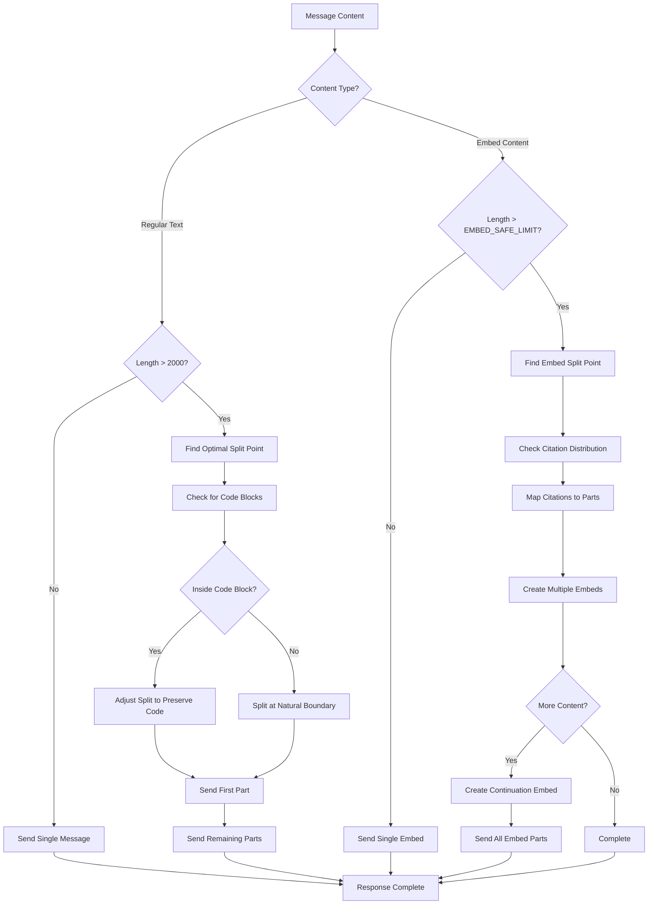
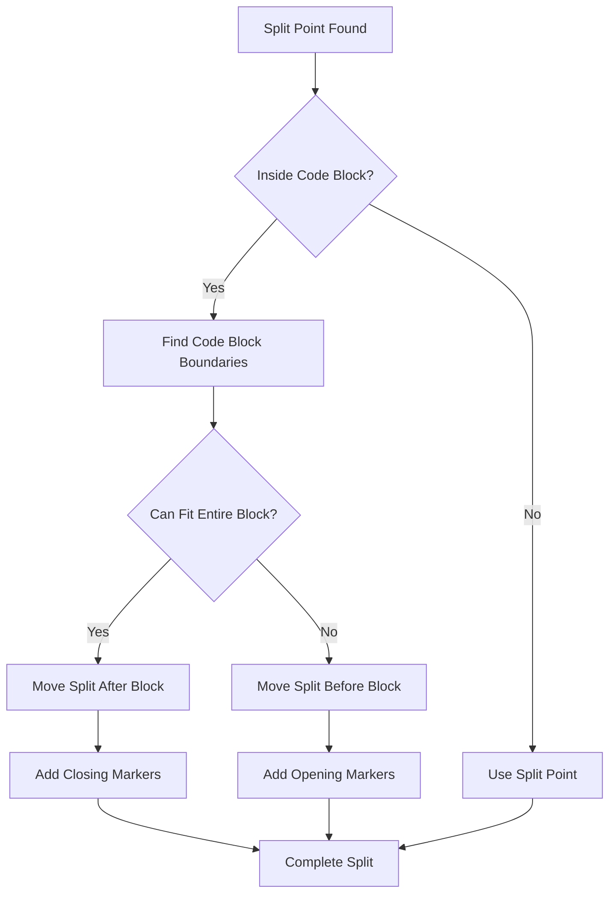
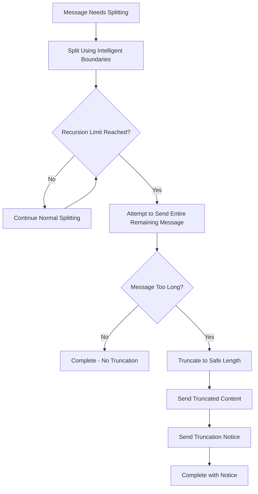

# Message Splitting & Character Limits

DiscordianAI implements intelligent message splitting to handle Discord's character limits while preserving formatting, code blocks, and citation functionality.

> **Note**: The constants `EMBED_LIMIT` and `EMBED_SAFE_LIMIT` referenced in this document are defined in `src/config.py`.

## Discord Character Limits

### Regular Messages
- **Limit**: 2000 characters
- **Usage**: OpenAI responses, plain text
- **Splitting**: Intelligent boundary detection

### Embed Descriptions  
- **Hard Limit**: 4096 characters (`EMBED_LIMIT` - Discord maximum)
- **Safe Limit**: 3840 characters (`EMBED_SAFE_LIMIT` - safe margin for citations)
- **Usage**: Perplexity responses with citations
- **Splitting**: Citation-aware splitting

#### Why Use a Safe Limit?

The 3840-character safe limit (`EMBED_SAFE_LIMIT`) provides a 256-character safety buffer (6.25%) for:

- **Citation Expansion**: `[1]` becomes `[[1]](https://very-long-url...)` (~15-20x expansion)
- **Footer Text**: "📚 5 sources" and continuation markers
- **Unicode Encoding**: Some characters require multiple bytes
- **Future-Proofing**: Room for additional formatting without breaking

## Message Splitting Algorithm

DiscordianAI uses a sophisticated message splitting algorithm that ensures content integrity while respecting Discord's character limits. The system includes recursion limit protection and intelligent boundary detection.

The following diagram shows how messages are intelligently split:



## Split Point Detection

### Priority Order
1. **Newline boundaries** - Preserve paragraph structure
2. **Sentence endings** - Maintain readability (. ! ?)
3. **Word boundaries** - Avoid cutting words in half
4. **Character limit** - Fallback when no good boundaries exist

### Code Block Preservation



## Citation-Aware Splitting

For Perplexity responses with citations, the splitting algorithm ensures citations remain functional:

```mermaid
flowchart TD
    A[Long Citation Content] --> B[Split at EMBED_SAFE_LIMIT]
    B --> C[Analyze Citation References]
    
    C --> D[Part 1: Citations 1-3]
    C --> E[Part 2: Citations 4-6]
    
    D --> F[Create Embed 1]
    E --> G[Create Embed 2]
    
    F --> H[Footer: "Web search results"]
    G --> I[Footer: "Web search results (continued)"]
    
    H --> J[Send Embed 1]
    I --> K[Send Embed 2]
    
    J --> L[All Citations Clickable]
    K --> L
```

## Code Examples

### Regular Message Splitting

```python
async def send_split_message(channel, message, deps, suppress_embeds=False):
    """Split long messages at optimal boundaries."""
    if len(message) <= 2000:
        await channel.send(message, suppress_embeds=suppress_embeds)
        return
    
    # Find optimal split point
    split_point = find_optimal_split_point(message, len(message) // 2)
    
    # Adjust for code blocks
    before, after = adjust_split_for_code_blocks(message, split_point)
    
    # Send parts
    await channel.send(before.strip(), suppress_embeds=suppress_embeds)
    if after.strip():
        await send_split_message(channel, after.strip(), deps, False)
```

### Embed Splitting with Citations

```python
async def send_split_message_with_embed(channel, message, deps, embed, citations):
    """Split embed content while preserving citations."""
    if len(message) <= EMBED_SAFE_LIMIT:
        await channel.send("", embed=embed)
        return
    
    # Split content
    split_point = find_optimal_split_point(message, EMBED_SAFE_LIMIT)
    part1, part2 = adjust_split_for_code_blocks(message, split_point)
    
    # Send first part with original embed
    await channel.send("", embed=embed)
    
    # Process remaining parts
    if part2 and citations:
        remaining_citations = find_citations_in_text(part2, citations)
        if remaining_citations:
            continuation_embed = create_citation_embed(
                part2, remaining_citations, 
                footer_text="Web search results (continued)"
            )
            await channel.send("", embed=continuation_embed)
```

## Split Point Algorithm

### Finding Optimal Boundaries

```python
def find_optimal_split_point(message: str, target_index: int) -> int:
    """Find the best place to split a message near the target index."""
    
    # Search window around target (±50 characters)
    search_start = max(0, target_index - 50)
    search_end = min(len(message), target_index + 50)
    search_area = message[search_start:search_end]
    
    # Priority 1: Newline boundaries
    newlines = [i for i, char in enumerate(search_area) if char == '\n']
    if newlines:
        return search_start + max(newlines) + 1
    
    # Priority 2: Sentence endings
    sentences = []
    for i, char in enumerate(search_area):
        if char in '.!?' and i < len(search_area) - 1:
            if search_area[i + 1] == ' ':
                sentences.append(i + 1)
    if sentences:
        return search_start + max(sentences)
    
    # Priority 3: Word boundaries
    words = [i for i, char in enumerate(search_area) if char == ' ']
    if words:
        return search_start + max(words)
    
    # Fallback: Use target index
    return target_index
```

## Best Practices

### For Developers

1. **Always check content length** before sending
2. **Use appropriate limits** (2000 for messages, `EMBED_SAFE_LIMIT` for embeds)
3. **Preserve formatting** when splitting
4. **Test with long content** to verify splitting works
5. **Handle edge cases** like very long words or URLs

### For Bot Configuration

1. **Set reasonable response limits** in AI API calls
2. **Monitor splitting frequency** in logs
3. **Test citation distribution** with long Perplexity responses
4. **Verify code block preservation** works correctly

## Troubleshooting

### Common Issues

**Messages cut off mid-word**:
- Check `find_optimal_split_point()` implementation
- Verify word boundary detection is working

**Code blocks broken across messages**:
- Ensure `adjust_split_for_code_blocks()` is called
- Check code block detection patterns

**Citations not working in split embeds**:
- Verify citation mapping is preserved
- Check that continuation embeds include relevant citations

**Infinite recursion in splitting**:
- Check recursion depth limits (max 10)
- Ensure fallback truncation works
- **NEW**: System now attempts to send remaining message when recursion limit is hit
- **NEW**: Only truncates if the attempt fails, with separate truncation notice message

### Performance Considerations

- **Split point calculation**: O(n) where n is search window size
- **Code block detection**: O(n) where n is message length  
- **Citation mapping**: O(c) where c is number of citations
- **Memory usage**: Minimal additional overhead

## Recursion Limit Protection

### How It Works

DiscordianAI includes sophisticated recursion limit protection to prevent infinite splitting loops:

1. **Normal Splitting**: Messages are split using intelligent boundary detection
2. **Recursion Limit Hit**: When recursion limit is reached, the system attempts to send the remaining message
3. **Fallback Truncation**: Only if the attempt fails (too long), the system truncates and sends a separate notice

### Recursion Limit Flow



### Benefits

- **Content Preservation**: Never truncates content unless absolutely necessary
- **Graceful Degradation**: Attempts full content delivery before truncation
- **User Awareness**: Clear truncation notice when limits are hit
- **Performance**: Prevents infinite recursion loops

## Advanced Configuration

### Customizing Split Behavior

```python
# Adjust search window for split points
SPLIT_SEARCH_WINDOW = 50  # characters around target

# Maximum recursion depth for splitting
MAX_SPLIT_RECURSION = 10

# Preferred split characters (in priority order)
SPLIT_PRIORITIES = ['\n', '. ', '! ', '? ', ' ']
```

### Monitoring Split Operations

```python
# Log split operations for debugging
logger.debug(f"Splitting message: {len(message)} chars at depth {depth}")
logger.debug(f"Split point found at index {split_point}")
logger.debug(f"Parts: {len(part1)} + {len(part2)} chars")
```
