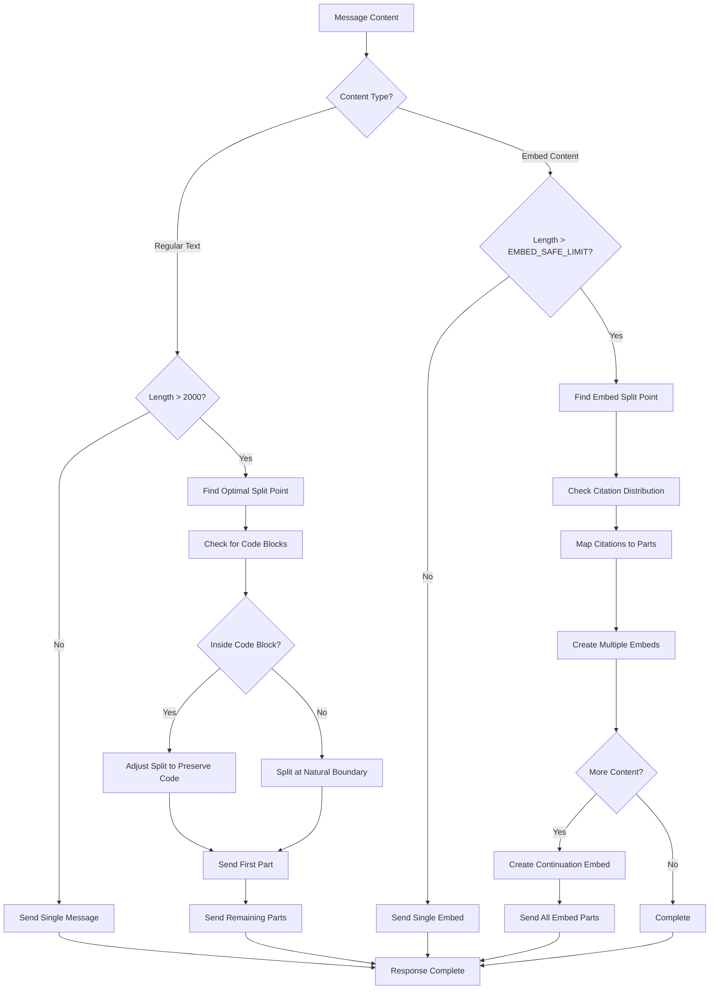
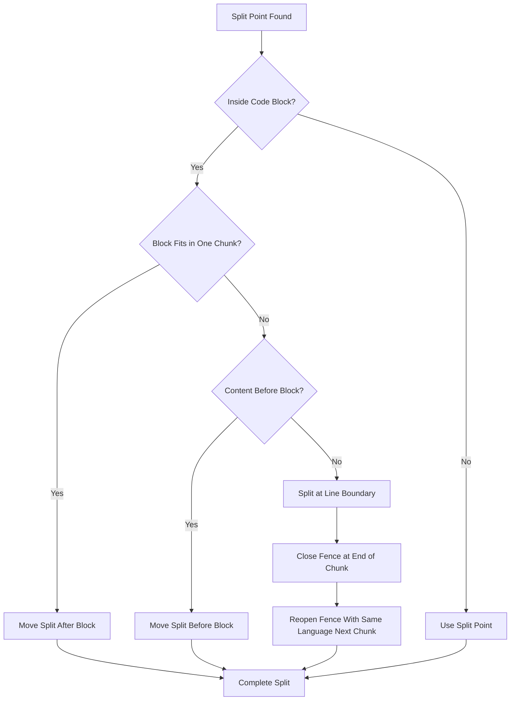
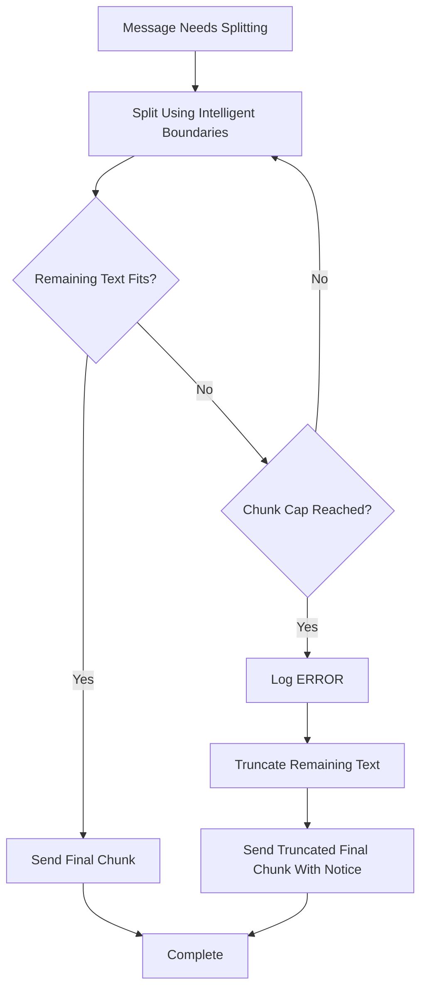

# Message Splitting & Character Limits

DiscordianAI implements intelligent message splitting to handle Discord's character limits while preserving formatting, code blocks, and citation functionality.

> **Note**: The constants `EMBED_LIMIT` and `EMBED_SAFE_LIMIT` referenced in this document are defined in `src/config.py`.

## Discord Character Limits

### Regular Messages
- **Limit**: 2000 characters
- **Usage**: OpenAI responses, plain text
- **Splitting**: Intelligent boundary detection

### Embed Descriptions  
- **Hard Limit**: 4096 characters (`EMBED_LIMIT` - Discord maximum)
- **Safe Limit**: 3840 characters (`EMBED_SAFE_LIMIT` - safe margin for citations)
- **Usage**: Perplexity responses with citations
- **Splitting**: Citation-aware splitting

#### Why Use a Safe Limit?

The 3840-character safe limit (`EMBED_SAFE_LIMIT`) provides a 256-character safety buffer (6.25%) for:

- **Citation Expansion**: `[1]` becomes `[[1]](https://very-long-url...)` (~15-20x expansion)
- **Footer Text**: "📚 5 sources" and continuation markers
- **Unicode Encoding**: Some characters require multiple bytes
- **Future-Proofing**: Room for additional formatting without breaking

## Message Splitting Algorithm

DiscordianAI uses a sophisticated message splitting algorithm that ensures content integrity while respecting Discord's character limits. The system includes a chunk-count safety cap and intelligent boundary detection.

The following diagram shows how messages are intelligently split:


```mermaid
flowchart TD
    A[Message Content] --> B{Content Type?}
    
    B -->|Regular Text| C{Length > 2000?}
    B -->|Embed Content| D{Length > EMBED_SAFE_LIMIT?}
    
    C -->|No| E[Send Single Message]
    C -->|Yes| F[Find Optimal Split Point]
    
    D -->|No| G[Send Single Embed]
    D -->|Yes| H[Find Embed Split Point]
    
    F --> I[Check for Code Blocks]
    H --> J[Check Citation Distribution]
    
    I --> K{Inside Code Block?}
    K -->|Yes| L[Adjust Split to Preserve Code]
    K -->|No| M[Split at Natural Boundary]
    
    J --> N[Map Citations to Parts]
    N --> O[Create Multiple Embeds]
    O --> P{More Content?}
    P -->|Yes| Q[Create Continuation Embed]
    P -->|No| R[Complete]
    
    L --> S[Send First Part]
    M --> S
    S --> T[Send Remaining Parts]
    
    G --> U[Response Complete]
    E --> U
    T --> U
    R --> U
    Q --> V[Send All Embed Parts]
    V --> U
```

## Split Point Detection

### Priority Order
1. **Newline boundaries** - Preserve paragraph structure
2. **Sentence endings** - Maintain readability (. ! ?)
3. **Word boundaries** - Avoid cutting words in half
4. **Character limit** - Fallback when no good boundaries exist

### Code Block Preservation

A split never leaves a closed code fence unbalanced. If the split point falls inside a
fenced block that fits in one chunk, the split moves after the block. If the
block is longer than a chunk, the split moves to a line boundary inside it,
closes the fence at the end of the chunk, and reopens it with the same language
tag at the start of the next chunk. A single line longer than the available
space is hard-wrapped; it is not dropped.


```mermaid
flowchart TD
    A[Split Point Found] --> B{Inside Code Block?}
    B -->|No| C[Use Split Point]
    B -->|Yes| D{Block Fits in One Chunk?}

    D -->|Yes| E[Move Split After Block]
    D -->|No| F{Content Before Block?}
    F -->|Yes| G[Move Split Before Block]
    F -->|No| H[Split at Line Boundary]

    H --> I[Close Fence at End of Chunk]
    I --> J[Reopen Fence With Same Language Next Chunk]

    E --> K[Complete Split]
    G --> K
    J --> K
    C --> K
```

## Citation-Aware Splitting

For Perplexity responses with citations, the splitting algorithm ensures citations remain functional. An embed head is also snapped so a split never falls inside a `[n]` citation marker or inside a code fence: a marker that would be cut moves whole into the next embed, and a long fence is closed and reopened with the same language tag.

```mermaid
flowchart TD
    A[Long Citation Content] --> B[Split at EMBED_SAFE_LIMIT]
    B --> C[Analyze Citation References]
    
    C --> D[Part 1: Citations 1-3]
    C --> E[Part 2: Citations 4-6]
    
    D --> F[Create Embed 1]
    E --> G[Create Embed 2]
    
    F --> H[Footer: "Web search results"]
    G --> I[Footer: "Web search results (continued)"]
    
    H --> J[Send Embed 1]
    I --> K[Send Embed 2]
    
    J --> L[All Citations Clickable]
    K --> L
```

## Code Examples

### Regular Message Splitting

```python
await send_split_message(
    channel,
    message,
    deps,
    suppress_embeds=False,
    original_message=original_message,
    mention_prefix=f"{user.mention} ",
)
```

### Embed Splitting with Citations

```python
await send_split_message_with_embed(
    channel,
    message,
    deps,
    embed,
    citations,
    original_message=original_message,
    mention_prefix=f"{user.mention} ",
)
```

## Split Point Algorithm

### Finding Optimal Boundaries

```python
def find_optimal_split_point(message: str, target_index: int) -> int:
    """Find the best place to split a message near the target index."""
    
    # Search window around target (±50 characters)
    search_start = max(0, target_index - 50)
    search_end = min(len(message), target_index + 50)
    search_area = message[search_start:search_end]
    
    # Priority 1: Newline boundaries
    newlines = [i for i, char in enumerate(search_area) if char == '\n']
    if newlines:
        return search_start + max(newlines) + 1
    
    # Priority 2: Sentence endings
    sentences = []
    for i, char in enumerate(search_area):
        if char in '.!?' and i < len(search_area) - 1:
            if search_area[i + 1] == ' ':
                sentences.append(i + 1)
    if sentences:
        return search_start + max(sentences)
    
    # Priority 3: Word boundaries
    words = [i for i, char in enumerate(search_area) if char == ' ']
    if words:
        return search_start + max(words)
    
    # Fallback: Use target index
    return target_index
```

## Best Practices

### For Developers

1. **Always check content length** before sending
2. **Use appropriate limits** (2000 for messages, `EMBED_SAFE_LIMIT` for embeds)
3. **Preserve formatting** when splitting
4. **Test with long content** to verify splitting works
5. **Handle edge cases** like very long words or URLs

### For Bot Configuration

1. **Set reasonable response limits** in AI API calls
2. **Monitor splitting frequency** in logs
3. **Test citation distribution** with long Perplexity responses
4. **Verify code block preservation** works correctly

## Troubleshooting

### Common Issues

**Messages cut off mid-word**:
- Check `find_optimal_split_point()` implementation
- Verify word boundary detection is working

**Code blocks broken across messages**:
- Long fences are split at a line boundary, closed at the end of each chunk, and reopened with the same language tag
- A closed fence split with an odd number of marker lines is a bug; check `split_fence_aware()`

**Citations not working in split embeds**:
- Verify citation mapping is preserved
- Check that continuation embeds include relevant citations

**Splitting stops at the chunk cap**:
- Check the maximum chunk count (50)
- Ensure the upstream provider is not returning far more text than its output budget allows
- Only the chunk cap truncates content; a single line wider than the limit is hard-wrapped, not dropped
- The notice reports the original answer length and says the bot's delivery limit was reached

### Performance Considerations

- **Split point calculation**: O(n) where n is search window size
- **Code block detection**: O(n) where n is message length  
- **Citation mapping**: O(c) where c is number of citations
- **Memory usage**: Minimal additional overhead

## Chunk Cap Protection

### How It Works

Splitting is iterative: the chunk list is computed up front and then sent in a loop. The chunk count is capped to stop a runaway response from producing hundreds of messages:

1. **Normal Splitting**: Messages are split using intelligent boundary detection until the remaining text fits.
2. **Chunk Cap Hit**: At 50 chunks the splitter logs an ERROR and stops, because no legitimate provider response needs that many messages.
3. **Indivisible Unit**: A code fence is split at a line boundary with balanced fences, and a single line wider than the limit is hard-wrapped. Only the chunk cap truncates content.
4. **Cap Notice**: The final chunk carries a visible notice with the original answer length and the bot's delivery limit.

### Chunk Cap Flow


```mermaid
flowchart TD
    A[Message Needs Splitting] --> B[Split Using Intelligent Boundaries]
    B --> C{Remaining Text Fits?}
    C -->|Yes| D[Send Final Chunk]
    C -->|No| E{Chunk Cap Reached?}
    E -->|No| B
    E -->|Yes| F[Log ERROR]
    F --> G[Truncate Remaining Text]
    G --> H[Send Truncated Final Chunk With Notice]
    D --> I[Complete]
    H --> I
```

### Benefits

- **Content Preservation**: Full-length provider answers are delivered in full, with no recursion-depth cutoff; long code fences keep every line and each chunk has balanced fences.
- **Runaway Guard**: A pathological response stops at a bounded number of messages.
- **User Awareness**: The truncation notice is reserved for the chunk cap and reports the original answer length and the bot's delivery limit.

## Provider Length-Limit Notice

A provider answer can stop before it is finished when it reaches the configured output-token
cap. DiscordianAI treats that as a partial answer, not a complete one:

- The chat-completions adapter reports its `finish_reason: length`.
- The Perplexity Agent adapter normalises `status: incomplete` with
  `incomplete_details.reason: max_output_tokens` to the same `length` signal.
- The orchestrator passes the partial text to delivery unchanged; the fixed notice is appended
  only when the answer is sent.
- The notice is one constant line, `TRUNCATION_NOTICE`, appended by
  `append_truncation_notice()`. It is never part of the model output or the conversation
  history, so follow-up turns do not replay it.
- An embed answer carries the notice in its description; a plain answer carries it after the
  final text chunk.

## Advanced Configuration

### Customizing Split Behavior

```python
# Discord limits used by the splitter
MESSAGE_LIMIT = 2000
EMBED_SAFE_LIMIT = 3840

# Maximum number of chunks sent for one message
MAX_SPLIT_CHUNKS = 50

# Prefer the helpers from ``src.message_splitter`` instead of duplicating the logic.
```

### Monitoring Split Operations

```python
# Log split operations for debugging
logger.debug(f"Splitting message: {len(message)} chars")
logger.debug(f"Split point found at index {split_point}")
logger.debug(f"Parts: {len(chunk)} chars, {len(chunks)} chunk(s) planned")
```
