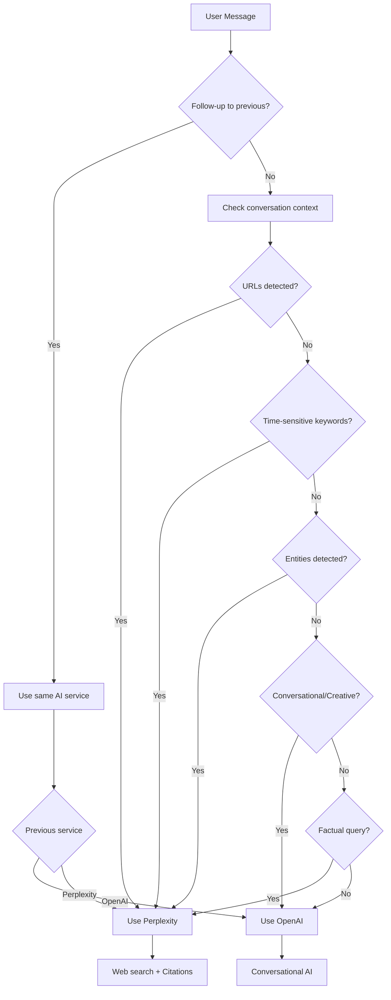

# DiscordianAI Documentation

Welcome to the DiscordianAI documentation! This guide covers everything you need to know about setting up, configuring, and using the DiscordianAI bot.

## 📚 Documentation Index

### 🚀 Getting Started
- **[Setup Guide](Setup.md)** - Complete installation and setup instructions
- **[Configuration](Configuration.md)** - Complete configuration reference
- **[Python Versions](Python_Versions.md)** - Python version compatibility

### 🤖 AI Integration
- **[OpenAI Integration](OpenAI.md)** - OpenAI API configuration and GPT models
- **[Perplexity Integration](Perplexity.md)** - Web search, citations, and Sonar models
- **[Smart Orchestration](HybridMode.md)** - How the bot chooses between AI services
- **[Web Scraping](WebScraping.md)** - URL content extraction for context

### 💬 Message Handling
- **[Message Splitting](MessageSplitting.md)** - How long messages are handled
- **[Embed Limits](EmbedLimits.md)** - Discord embed size limits and strategies
- **Conversational UX**
    - Bot shows typing indicators while AI responses are being generated
    - All replies are threaded (reply-to) and start with the requesting user's mention for clarity

### 🔧 Infrastructure
- **[Architecture](Architecture.md)** - System design, patterns, and components
- **[Connection Pooling](ConnectionPooling.md)** - HTTP/2 connection optimization

### 🚀 Deployment
- **[Docker](Docker.md)** - Containerized deployment
- **[Daemon Mode](Daemon.md)** - Running as a background service

### 🛡️ Security & Development
- **[Security](Security.md)** - API key management, rate limiting, hardening
- **[Development Guide](Development.md)** - Modern workflow with black + ruff

---

## 🤖 AI Service Selection

The bot intelligently chooses between OpenAI and Perplexity based on message content:

---

## 🎯 Quick Navigation

| If you want to... | Read this |
|-------------------|-----------|
| Set up the bot from scratch | [Setup Guide](Setup.md) |
| Configure bot settings | [Configuration](Configuration.md) |
| Set up OpenAI API | [OpenAI Integration](OpenAI.md) |
| Set up Perplexity API | [Perplexity Integration](Perplexity.md) |
| Understand the architecture | [Architecture](Architecture.md) |
| Deploy with Docker | [Docker](Docker.md) |
| Run as a service | [Daemon Mode](Daemon.md) |
| Contribute to development | [Development Guide](Development.md) |

---

## 🔗 External Resources

- **[GitHub Repository](https://github.com/johndotpub/DiscordianAI)**
- **[Issue Tracker](https://github.com/johndotpub/DiscordianAI/issues)**
- **[Discord.py Documentation](https://discordpy.readthedocs.io/)**
- **[OpenAI API Documentation](https://platform.openai.com/docs/)**
- **[Perplexity API Documentation](https://docs.perplexity.ai/)**
