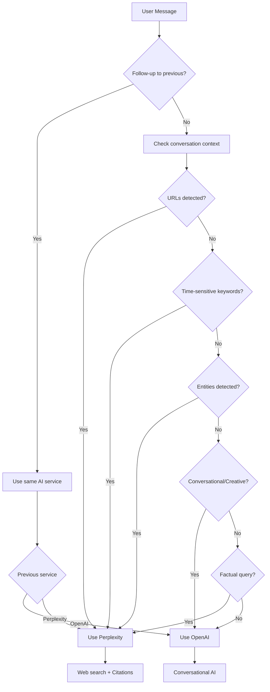

# DiscordianAI Documentation

Welcome to the DiscordianAI documentation! This guide covers everything you need to know about setting up, configuring, and using the DiscordianAI bot.

## 📚 Documentation Index

### 🚀 Getting Started
- **[Setup Guide](Setup.md)** - Complete installation and setup instructions
- **[Configuration](Configuration.md)** - Complete configuration guide

### ⚙️ Configuration
- **[Configuration Guide](Configuration.md)** - Complete configuration reference
- **[OpenAI Setup](OpenAI.md)** - OpenAI API configuration and models
- **[Perplexity Setup](Perplexity.md)** - Perplexity API configuration

### 🤖 Bot Features
- **[Smart Orchestration](HybridMode.md)** - How the bot chooses between AI services
- **[Message Splitting](MessageSplitting.md)** - How long messages and embeds are handled
- **[OpenAI Integration](OpenAI.md)** - OpenAI models and capabilities
- **[Perplexity Integration](Perplexity.md)** - Web search and citations
- **[Web Scraping](WebScraping.md)** - URL content extraction

## AI Service Selection

The bot intelligently chooses between OpenAI and Perplexity based on message content:

### 🔧 Development
- **[Development Guide](Development.md)** - Modern development workflow with black + ruff
- **[Python Versions](Python_Versions.md)** - Python version compatibility and testing
- **[API Validation](API_Validation.md)** - API parameter validation and health checks
- **[Connection Pooling](ConnectionPooling.md)** - HTTP connection optimization
- **[Embed Limits](EmbedLimits.md)** - Discord embed size handling

### 📖 Reference
- **[API Validation](API_Validation.md)** - API parameter validation and health checks
- **[Connection Pooling](ConnectionPooling.md)** - HTTP connection pool management
- **[Embed Limits](EmbedLimits.md)** - Discord message and embed limits

### 🚀 Deployment
- **[Docker](Docker.md)** - Containerized deployment
- **[Daemon Mode](Daemon.md)** - Running as a system service

## 🎯 Quick Navigation

- **New to DiscordianAI?** Start with [Setup Guide](Setup.md)
- **Configuring the bot?** Check [Configuration Guide](Configuration.md)
- **Setting up APIs?** See [OpenAI](OpenAI.md) and [Perplexity](Perplexity.md) guides
- **Developing?** Read [Development Guide](Development.md)
- **Deploying?** See [Docker](Docker.md) and [Daemon](Daemon.md) guides

## 📝 Contributing

Found an error or want to improve the documentation? See our [Contributing Guide](../CONTRIBUTING.md) for details on how to submit changes.

## 🔗 External Links

- **[GitHub Repository](https://github.com/johndotpub/DiscordianAI)**
- **[Issue Tracker](https://github.com/johndotpub/DiscordianAI/issues)**
- **[Discord.py Documentation](https://discordpy.readthedocs.io/)**
- **[OpenAI API Documentation](https://platform.openai.com/docs/)**
- **[Perplexity API Documentation](https://docs.perplexity.ai/)**
