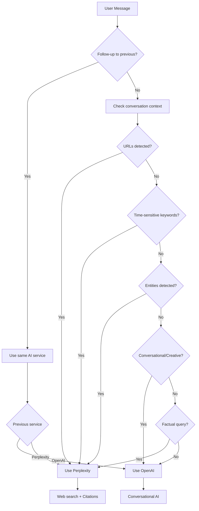

# DiscordianAI Documentation

Welcome to the DiscordianAI documentation! This guide covers everything you need to know about setting up, configuring, and using the DiscordianAI bot.

## 📚 Documentation Index

### 🚀 Getting Started
- **[Installation](Installation.md)** - How to install and set up DiscordianAI
- **[Configuration](Configuration.md)** - Complete configuration guide
- **[Quick Start](Quick_Start.md)** - Get up and running in minutes

### ⚙️ Configuration
- **[API Configuration](API_Configuration.md)** - OpenAI and Perplexity API setup
- **[Discord Setup](Discord_Setup.md)** - Bot creation and permissions
- **[Environment Variables](Environment_Variables.md)** - Using environment variables

### 🤖 Bot Features
- **[AI Models](AI_Models.md)** - Available AI models and capabilities
- **[Smart Orchestration](HybridMode.md)** - How the bot chooses between AI services
- **[Message Splitting](MessageSplitting.md)** - How long messages and embeds are handled
- **[Conversation Management](Conversation_Management.md)** - How conversations are handled
- **[Rate Limiting](Rate_Limiting.md)** - Bot rate limiting and spam prevention

## AI Service Selection

The bot intelligently chooses between OpenAI and Perplexity based on message content:

### 🔧 Development
- **[Development Guide](Development.md)** - Modern development workflow with black + ruff
- **[Python Versions](Python_Versions.md)** - Python version compatibility and testing
- **[API Reference](API_Reference.md)** - Technical API documentation
- **[Testing](Testing.md)** - How to run tests and contribute

### 📖 Reference
- **[API Validation](API_Validation.md)** - API parameter validation and health checks
- **[Error Handling](Error_Handling.md)** - Error handling and recovery
- **[Performance](Performance.md)** - Performance optimization and monitoring
- **[Security](Security.md)** - Security considerations and best practices

### 🚀 Deployment
- **[Deployment](Deployment.md)** - Production deployment guide
- **[Docker](Docker.md)** - Containerized deployment
- **[Monitoring](Monitoring.md)** - Health monitoring and alerting
- **[Troubleshooting](Troubleshooting.md)** - Common issues and solutions

## 🎯 Quick Navigation

- **New to DiscordianAI?** Start with [Installation](Installation.md)
- **Setting up APIs?** Check [API Configuration](API_Configuration.md)
- **Developing?** Read [Development Guide](Development.md)
- **Deploying?** See [Deployment](Deployment.md)
- **Having issues?** Check [Troubleshooting](Troubleshooting.md)

## 📝 Contributing

Found an error or want to improve the documentation? See our [Contributing Guide](../CONTRIBUTING.md) for details on how to submit changes.

## 🔗 External Links

- **[GitHub Repository](https://github.com/johndotpub/DiscordianAI)**
- **[Issue Tracker](https://github.com/johndotpub/DiscordianAI/issues)**
- **[Discord.py Documentation](https://discordpy.readthedocs.io/)**
- **[OpenAI API Documentation](https://platform.openai.com/docs/)**
- **[Perplexity API Documentation](https://docs.perplexity.ai/)**
