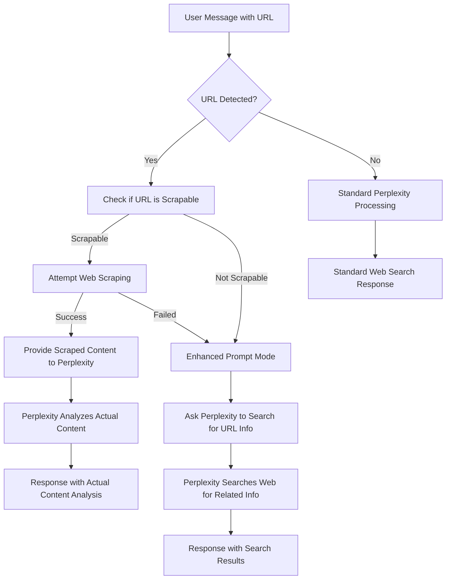

# Web Scraping Integration

DiscordianAI includes intelligent web scraping capabilities to extract actual content from URLs, providing more accurate and contextual responses when users share links.

## Overview

When users include URLs in their messages, the bot:

1. **Automatically detects URLs** using smart pattern matching
2. **Attempts to scrape content** directly from the webpage
3. **Provides scraped content** to Perplexity for analysis
4. **Falls back gracefully** if scraping fails
5. **Logs all activities** for debugging and transparency

## How It Works

### URL Detection and Processing Flow



### Content Extraction Strategy

The web scraper uses intelligent content extraction:

1. **Page Title** - Extracted from `<title>` tag
2. **Meta Description** - From `<meta name="description">` 
3. **Main Content** - Using semantic selectors:
   - `<main>`, `<article>`, `[role="main"]`
   - `.content`, `.post-content`, `.entry-content`
   - `.markdown-body` (for GitHub and similar platforms)
4. **Key Headings** - H1-H3 tags for structure
5. **Clean Text** - Removes navigation, footers, scripts

### Supported Content Types

✅ **Supported URLs:**
- GitHub repositories, pull requests, issues
- News articles and blog posts
- Documentation websites
- General web pages with standard HTML structure

❌ **Unsupported URLs:**
- PDF files, Word documents, spreadsheets
- Archive files (ZIP, TAR, etc.)
- Non-HTTP protocols (FTP, file://, etc.)

## Configuration

### Dependencies

The web scraping feature requires additional Python packages:

```txt
requests>=2.31.0
beautifulsoup4>=4.12.2
```

These are automatically included in `requirements.txt` and installed with the bot.

### Scraping Settings

Web scraping behavior is controlled by constants in `src/web_scraper.py`:

```python
DEFAULT_TIMEOUT = 10  # Request timeout in seconds
MAX_CONTENT_LENGTH = 50000  # Maximum content to extract (~12-15k tokens)
```

### Browser Headers

The scraper uses realistic browser headers to avoid being blocked:

```python
DEFAULT_HEADERS = {
    "User-Agent": "Mozilla/5.0 (Windows NT 10.0; Win64; x64) AppleWebKit/537.36...",
    "Accept": "text/html,application/xhtml+xml,application/xml...",
    "Accept-Language": "en-US,en;q=0.9",
    # ... additional headers for compatibility
}
```

## Logging and Debugging

### Comprehensive Logging

The web scraper provides detailed logging at multiple levels:

```python
# Info level - successful operations
logger.info(f"Successfully scraped {len(content)} characters from {url}")

# Debug level - detailed process information  
logger.debug(f"Scraped content preview: {content[:200]}...")
logger.debug(f"Found content using selector: {selector}")

# Warning level - issues that don't prevent operation
logger.warning(f"Content too large ({size} bytes), skipping: {url}")

# Error level - failures that prevent scraping
logger.error(f"HTTP error {status_code} for URL: {url}")
```

### What Gets Logged

**For Each URL Processing Attempt:**
- URL validation and scrapability check
- HTTP request details and response status
- Content extraction method used
- Final content length and preview
- Any errors or fallbacks encountered

**For Scraped Content:**
- **Yes, scraped content is logged** for debugging purposes
- Content preview (first 200 characters) in debug logs
- Full content length for token management
- Truncation notices if content was too long

## Error Handling

### Graceful Degradation

The web scraper implements comprehensive error handling:

1. **Network Errors** - Timeout, connection issues, DNS failures
2. **HTTP Errors** - 404, 403, 500, etc.
3. **Content Errors** - Malformed HTML, empty responses
4. **Size Limits** - Content too large for processing

### Fallback Strategy

When web scraping fails, the bot:

1. **Logs the failure** with specific error details
2. **Falls back to enhanced prompts** asking Perplexity to search for URL information
3. **Continues processing** without breaking the conversation flow
4. **Provides helpful messages** explaining limitations when appropriate

## Performance Considerations

### Asynchronous Processing

- Web scraping runs in thread pools to avoid blocking
- Multiple URLs are processed concurrently
- Timeout limits prevent hanging requests

### Content Limits

- **50KB maximum** raw content extraction (~12-15k tokens)
- **Automatic truncation** with clear indicators
- **Size checks** before downloading large files

### Caching

Web scraping integrates with the existing caching system:
- Scraped content can be cached to avoid repeated requests
- Cache keys include URL and processing parameters
- TTL-based expiration for time-sensitive content

## Usage Examples

### GitHub Pull Request Analysis

```
User: "Check out this PR: https://github.com/johndotpub/DiscordianAI/pull/197"

Bot Process:
1. Detects GitHub URL
2. Scrapes PR content (title, description, commits, status)
3. Provides scraped content to Perplexity
4. Perplexity analyzes actual PR content
5. Returns detailed analysis with citations

Response: "I've analyzed the pull request content directly..."
```

### Multiple URL Processing

```
User: "Compare these articles: https://site1.com/article1 https://site2.com/article2"

Bot Process:
1. Detects both URLs
2. Scrapes content from both articles
3. Provides combined content to Perplexity
4. Perplexity compares actual article content
5. Returns comprehensive comparison

Response: "Based on the content from both articles..."
```

### Fallback Handling

```
User: "What's in this PDF? https://example.com/document.pdf"

Bot Process:
1. Detects PDF URL
2. Recognizes PDF is not scrapable
3. Uses enhanced prompt mode
4. Perplexity searches for information about the URL
5. Returns search-based response with fallback notice

Response: "I searched for information about this document... 
**Note**: I couldn't access the PDF directly..."
```

## Troubleshooting

### Common Issues

**Web scraping fails for specific sites:**
- Some sites block automated requests
- JavaScript-heavy sites may not render content
- Authentication-required pages are inaccessible
- Rate limiting by the target website

**Large content handling:**
- Content over 50KB is automatically truncated
- Truncation notices are added to responses
- Token limits prevent API overload

### Debug Information

Enable debug logging to see detailed web scraping information:

```ini
[Logging]
LOG_LEVEL=DEBUG
```

This will show:
- URL validation results
- HTTP request/response details
- Content extraction process
- Scraping success/failure reasons
- Fallback activation triggers
